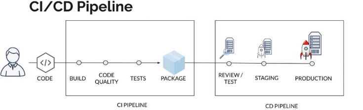
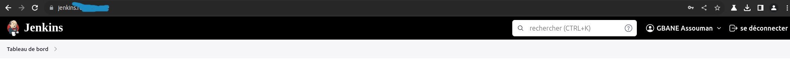
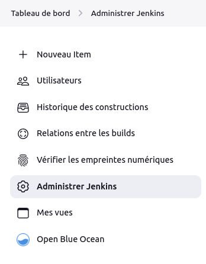
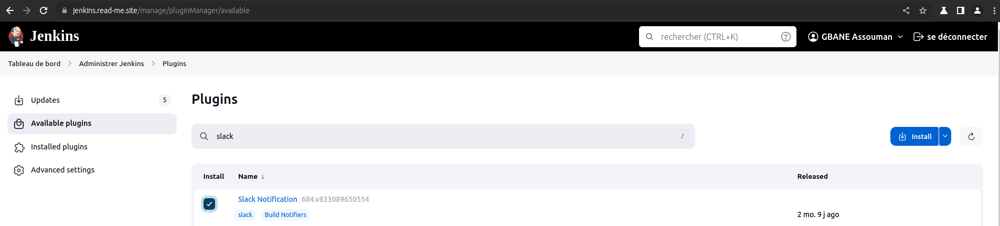
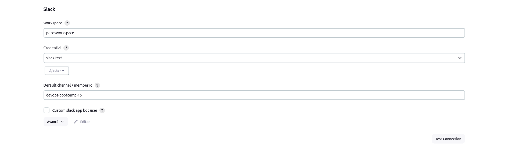
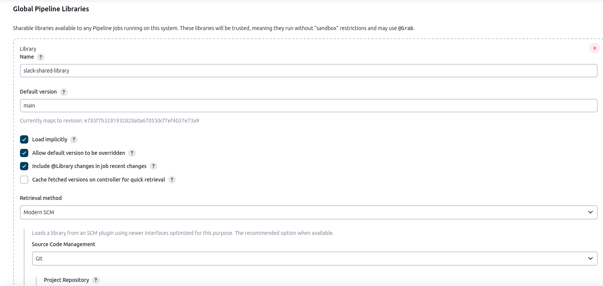
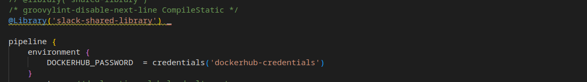
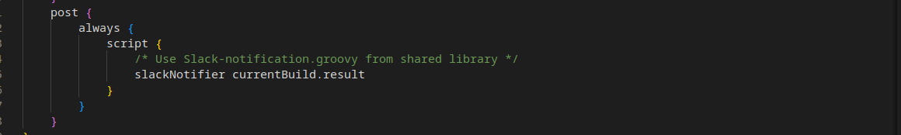

# Mini Projet Jenkins
<div align="center">


</div>

Ce Projet dénommé Mini projet jenkins a été réalisé dans le cadre ma formation DEVOPS au cours du Bootcamp numéro 15 de **EAZYTraining avec Dirane Tafen et Ulrich Monji** qui s'est deroulé de Septembre à Novembre 2023.


## Objectifs
Il s’agit ici de mettre en œuvre une chaîne d’intégration continue pour un site web static *(voir image en dessous)* avec jenkins. le code source est [ici](https://github.com/diranetafen/static-website-example) .


 
## À faire
Pour la réalisation du project j'ai procédé comme suit:
- 1 Provisionner 3 VPS 
- 2 installer docker sur chaque vps <!--à partir de la documentation officielle qui se trouve [ici](https://docs.docker.com/engine/install/debian/)  -->
- 3 Installer jenkins sur le vps 
- 4 Produire le Dockerfile pour le Build
- 5 Mettre en place le Pipeline
- 6 Configurer github webhook
- 7 Intégrer la notification slack


## Plan de Travail
J'ai suivi les étapes ci-dessous pour la réalisation du projet.

J’ai choisi 03 VPS de type Lightsail chez *AWS* *(01 pour Jenkins, 01 pour l'environnement de staging et le dernier pour l'environnement de la Prod)*


Sur chaque VPS j’ai installé  Debian 11.4, docker et docker-compose
Sur le VPS de jenkins :
  j’ai installé jenkins à l’aide de docker-compose sur le vps jenkins. Dans ma configuration le conteneur n’est accessible que sur la machine hôte à partir de  **127.0.0.1:8080**

```
version: '3.3'

services:
  jenkins:
    image: jenkins/jenkins:lts
    container_name: jenkins
    restart: always
    privileged: true
    user: root #update to set it for jenkins
    ports:
    - 127.0.0.1:8080:8080
    volumes:
      - /home/admin/.jenkins:/var/jenkins_home
      - /var/run/docker.sock:/var/run/docker.sock
      - /usr/bin/docker:/usr/bin/docker
```
```
CONTAINER ID   IMAGE                 COMMAND                  CREATED       STATUS       PORTS                                 NAMES
342c609e0a56   jenkins/jenkins:lts   "/usr/bin/tini -- /u…"   11 days ago   Up 9 hours   127.0.0.1:8080->8080/tcp, 50000/tcp   jenkins
```

Afin d’accéder à jenkins en dehors de l’hôte , j’ai installé Apache2 et fais un reverse proxy sur le **127.0.0.1:8080**

```
<VirtualHost *:80>
        ServerName jenkins.xxxxx
        ServerAdmin webmaster@localhost
        ProxyPass         /  http://127.0.0.1:8080/ nocanon
        ProxyPassReverse  /  http://127.0.0.1:8080/
        ProxyRequests     Off
        AllowEncodedSlashes NoDecode
        RequestHeader set X-Forwarded-Proto "https"
        RequestHeader set X-Forwarded-Port "443"
        <Proxy http://127.0.0.1:8080/*>
          Order deny,allow
          Allow from all
        </Proxy>
        ErrorLog ${APACHE_LOG_DIR}/jenkins.error.log
        CustomLog ${APACHE_LOG_DIR}/jenkins.access.log combined

RewriteEngine on
RewriteCond %{SERVER_NAME} =jenkins.xxxxx
RewriteRule ^ https://%{SERVER_NAME}%{REQUEST_URI} [END,NE,R=permanent]
</VirtualHost>

```

et  enfin configuré letsencrypt avec un sous-domaine.



# Intrégation de la notification Slack 

# 
Nous allons intégrer slack à notre environnement jenkins pour recevoir directement des notifications après l'execution de notre pipeline.


# Installation du plugin slack-notification

Voici les étapes à suivre pour ajouter l’intégration Jenkins CI.

### Étape 1
Dans le tableau de bord Jenkins, cliquez sur Administrer Jenkins dans la barre de navigation à gauche.


### Étape 2
Cliquez sur Plugins puis Available plugins et recherchez Slack Notification dans l’onglet search available plugins. Cochez la case et installez le plugin.



### Étape 3 
Une fois l’installation effectuée, cliquez de nouveau sur Administrer Jenkins dans le volet de navigation gauche, puis accédez à **Configure System** (Configurer le système).

Recherchez la section **Global Slack Notifier Settings** (Paramètres de notification Slack globaux) et ajoutez les valeurs suivantes :

Sous-domaine de l’équipe : **workspace**
Identifiant d’authentification où jeton d’intégration : Créez un identifiant de type secret texte ayant pour valeur **Token**
NB:
Pour obtenir le **workspace** et **Token** il faut au préalable:
- 1 créer un compte slack 
- 2 configurer l'intégration de jenkins à partir d'[ici](https://myspace.slack.com/services/new/jenkins-ci)




à partir de cet instant on peux ajouter les notifications slack dans le **Jenkinsfile**

à fin de rendre disponible la notification slack à tous les projets, je l'ai transformé en **Shared Library** ce qui va permettre de faire un simple appel dans les **Jenkinsfiles**.

Pour ce faire j'ai :

- créée un depôt **Github** [voir ici](https://github.com/gbaneassouman/shared-library/blob/main/vars/slackNotifier.groovy) et ajouté un fichier de type groovy appelé *(slackNotifier.groovy)* ensuite definir la fonction de notification

```
#!/usr/bin/env groovy

def call(String buildResult) {
  if ( buildResult == "SUCCESS" ) {
    slackSend color: "good", message: "CONGRATULATION: Job ${env.JOB_NAME} with buildnumber ${env.BUILD_NUMBER} was successful ! more info ${env.BUILD_URL}"
  }
  else if( buildResult == "FAILURE" ) { 
    slackSend color: "danger", message: "BAD NEWS:Job ${env.JOB_NAME} with buildnumber ${env.BUILD_NUMBER} was failed ! more info ${env.BUILD_URL}"
  }
  else if( buildResult == "UNSTABLE" ) { 
    slackSend color: "warning", message: "BAD NEWS:Job ${env.JOB_NAME} with buildnumber ${env.BUILD_NUMBER} was unstable ! more info ${env.BUILD_URL}"
  }
  else {
    slackSend color: "danger", message: "BAD NEWS:Job ${env.JOB_NAME} with buildnumber ${env.BUILD_NUMBER} its result was unclear ! more info ${env.BUILD_URL}"	
  }
}
```

- configurer la Shared Library à partir de ***Administrer jenkins -> System -> Global Pipeline Libraries***



- importer la Shared library précédemment configurée dans le Jenkinsfile 


- et faire appel à la fonction de notification



## Demo

voir [ici](https://github.com/diranetafen/student-list.git "here")


## 🚀 à propos de moi

Session           : Bootcamp DevOps N°15 de EAZYTraining

Période           : Septembre - Novembre

Prénoms & Nom : Assouman GBANE 

LinkedIn          : https://www.linkedin.com/in/gbane-assouman-4ab183123/


## Environment Variables

To run this project, you will need to add the following environment variables to your .env file

`API_KEY`

`ANOTHER_API_KEY`

