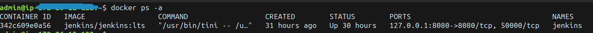
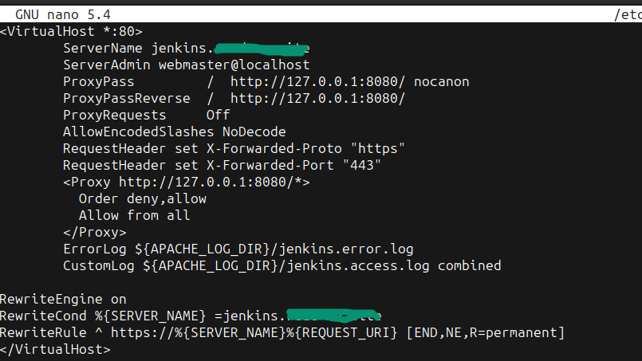
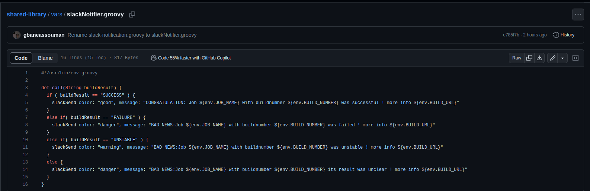

# Mini Projet Jenkins

Ce Projet dénommé Mini projet jenkins a été réalisé dans le cadre ma formation DEVOPS au cours du Bootcamp numéro 15 de **EAZYTraining avec Dirane Tafen et Ulrich Monji** qui s'est deroulé de Septembre à Novembre 2023.

## Objectifs
Il s’agit ici de mettre en œuvre une chaîne d’intégration continue pour un site web static *(voir image en dessous)* avec jenkins. le code source est [ici](https://github.com/diranetafen/static-website-example) .

 
## À faire
Pour la réalisation du project j'ai procédé comme suit:
- 1 Provisionner 3 VPS 
- 2 installer docker sur chaque vps à partir de la documentation officielle qui se trouve [ici](https://docs.docker.com/engine/install/debian/) 
- 3 Installer jenkins sur le vps 
- 4 Produire le Dockerfile pour le Build
- 5 La mise en place du Pipeline
- 6 Configurer github webhook
- 7 Notification slack

## Plan de Travail
J'ai suivi les étapes ci-dessous pour la réalisation du projet.

J’ai choisi 03 VPS de type Lightsail chez *AWS* *(01 pour Jenkins, 01 pour l'environnement de staging et le dernier pour l'environnement de la Prod)*

Sur chaque VPS j’ai installé  Debian 11.4, docker et docker-compose
Sur le VPS de jenkins :
  j’ai installé jenkins à l’aide de docker-compose. Dans ma configuration le conteneur n’est accessible que sur la machine hôte à partir de  **127.0.0.1:8080**

Afin d’accéder à jenkins en dehors de l’hôte , j’ai installé Apache2 et fais un reverse proxy sur le **127.0.0.1:8080**

et  enfin configuré letsencrypt avec un sous-domaine.

# Notification Slack 

# 
Nous allons intégrer slack à notre environnement jenkins pour recevoir directement des notifications après l'execution de notre pipeline.

# Installation du plugin slack-notification

Voici les étapes à suivre pour ajouter l’intégration Jenkins CI.

### Étape 1
Dans le tableau de bord Jenkins, cliquez sur Gérer Jenkins dans la barre de navigation à gauche.

### Étape 2
Cliquez sur Plugins puis Available plugins et recherchez Notification Slack dans l’onglet search available plugins. Cochez la case et installez le plugin.

### Étape 3 
Une fois l’installation effectuée, cliquez de nouveau sur Administrer Jenkins dans le volet de navigation gauche, puis accédez à Configure System (Configurer le système).

Recherchez la section Global Slack Notifier Settings (Paramètres de notification Slack globaux) et ajoutez les valeurs suivantes :

Sous-domaine de l’équipe : **workspace**
Identifiant d’authentification du jeton d’intégration : Créez un identifiant de  secret texte ayant pour valeur **Token**
NB:
Pour obtenir le **workspace** et **Token** il faut au préalable  comme suit:
- 1 créer un compte slack 
- 2 configurer l'intégration de jenkins à partir d'[ici](https://myspace.slack.com/services/new/jenkins-ci)

à partir de cet instant on peux ajouter les notifications slack dans mon **Jenkinsfile**

à fin de rendre disponible la notification slack à tous les projets, je vais la transformer en **Shared Library** ce qui va permettre de faire un simple appel dans les **Jenkinsfiles**.

Pour ce faire j'ai :

- créer un depôt **Github** [voir ici](https://github.com/gbaneassouman/shared-library/blob/main/vars/slackNotifier.groovy) et ajouter un fichier de type groovy appelé *(slackNotifier.groovy)* ensuite definir la fonction de notification

- configurer la Shared Library à partir de ***Administrer jenkins -> System -> Global Pipeline Libraries***

- importer la Shared library précédemment configurée dans le Jenkinsfile 

- et faire appel à la fonction de notification

## Demo

voir [ici](https://github.com/diranetafen/student-list.git "here")

## 🚀 à propos de moi

Session           : Bootcamp DevOps N°15 de EAZYTraining

Période           : Septembre - Novembre

Prénoms & Nom : Assouman GBANE 

LinkedIn          : https://www.linkedin.com/in/gbane-assouman-4ab183123/

## Environment Variables

To run this project, you will need to add the following environment variables to your .env file

`API_KEY`

`ANOTHER_API_KEY`

