# Mini Projet Jenkins
<div align="center">


</div>

Ce Projet dénommé Mini projet jenkins a été réalisé dans le cadre ma formation DEVOPS au 15ième Bootcamp de **EAZYTraining** de Septembre à Novembre 2023.


## Objectifs
Il s’agit ici de mettre en œuvre une chaîne d’intégration continue pour un site web static *(voir image en dessous)* avec jenkins. le code source du site est [ici](https://github.com/diranetafen/static-website-example) .


 
## Tâches réalisées
Pour la réalisation de ce project j'ai effectuée les tâches ci-dessous:
- Provisionner 3 VPS 
- Installer docker sur chaque vps 
- Installer jenkins sur un des vps 
- Produire le Dockerfile pour le Build
- Mettre en place le Pipeline
  - Configuration de github webhook
  - Intégration de la notification slack
  - Production du Jenkinsfile


## Plan de Travail
J'ai suivi les étapes ci-dessous pour la réalisation du projet.

J’ai choisi 03 VPS de type Lightsail chez *AWS* *(01 pour Jenkins, 01 pour l'environnement de staging et le dernier pour l'environnement de la Prod)*


Sur chaque VPS j’ai installé:
- Debian 11.4
- docker et docker-compose en suivant la documentation qui se trouve [ici](https://docs.docker.com/engine/install/debian/)

Sur le VPS de jenkins :
- Jenkins a été installé à l’aide d'un fichier docker-compose . Dans cette configuration le conteneur n’est accessible que sur la machine hôte à partir de  **127.0.0.1:8080**

```
version: '3.3'

services:
  jenkins:
    image: jenkins/jenkins:lts
    container_name: jenkins
    restart: alwaysIntrégation de la notification Slack 
    privileged: true
    user: root #update to set it for jenkins
    ports:
    - 127.0.0.1:8080:8080
    volumes:
      - /home/admin/.jenkins:/var/jenkins_home
      - /var/run/docker.sock:/var/run/docker.sock
      - /usr/bin/docker:/usr/bin/docker
```
```
CONTAINER ID   IMAGE                 COMMAND                  CREATED       STATUS       PORTS                                 NAMES
342c609e0a56   jenkins/jenkins:lts   "/usr/bin/tini -- /u…"   11 days ago   Up 9 hours   127.0.0.1:8080->8080/tcp, 50000/tcp   jenkins
```

Afin d’accéder à jenkins en dehors de l’hôte , j’ai installé Apache2 et fais un reverse proxy sur le **127.0.0.1:8080**

```
<VirtualHost *:80>
        ServerName jenkins.xxxxx
        ServerAdmin webmaster@localhost
        ProxyPass         /  http://127.0.0.1:8080/ nocanon
        ProxyPassReverse  /  http://127.0.0.1:8080/
        ProxyRequests     Off
        AllowEncodedSlashes NoDecode
        RequestHeader set X-Forwarded-Proto "https"
        RequestHeader set X-Forwarded-Port "443"
        <Proxy http://127.0.0.1:8080/*>
          Order deny,allow
          Allow from all
        </Proxy>
        ErrorLog ${APACHE_LOG_DIR}/jenkins.error.log
        CustomLog ${APACHE_LOG_DIR}/jenkins.access.log combined

RewriteEngine on
RewriteCond %{SERVER_NAME} =jenkins.xxxxx
RewriteRule ^ https://%{SERVER_NAME}%{REQUEST_URI} [END,NE,R=permanent]
</VirtualHost>

```

et  enfin installé et configuré letsencrypt avec un sous-domaine sur chaque VPS.


# Dockerfile 
Voici ci-dessous le dockerfile qui a permit de créer l'image Docker à partir de laquelle nos conteneurs seront créées.
```
FROM nginx:latest
LABEL maintainer="GBANE Assouman gbane.assouman@gmail.com"
WORKDIR /usr/share/nginx/html
COPY . .
EXPOSE 80
CMD [ "nginx","-g","daemon off;" ]

```
- <strong>image de base Docker</strong><br/>
FROM nginx:latest<br/>
LABEL maintainer="GBANE Assouman gbane.assouman@gmail.com"

- <strong>Répertoire du site</strong><br/>
WORKDIR /usr/share/nginx/html

- <strong>Copie des fichiers dans le répertoire WORKDIR</strong><br/>
COPY . .

- <strong>Port d'écoute de NGINX </strong><br/>
EXPOSE 80

- <strong>Démarrage de NGINX</strong><br/>
CMD [ "nginx","-g","daemon off;" ]

# Mise en place du Pipeline
Pour la mise en place du pipeline il faut:
- installer les plugins necéssaires
- créer des credentials
- créer un nouveau item de type pipeline
  
<strong>Installation des plugins </strong><br/>
Pour l'installation des puglins necéssaires au pipeline on va dans 

**Tableau de bord -> Administrer jenkins -> Plugins -> Available plugins** puis chercher et installer les plugins suivants:
- Docker 
- Docker pipeline
- Docker plugin
- Github integration Plugin
- SSH Agent plugin

<strong>Création des crédentials</strong><br/>
Afin de pusher l'image buildée sur Docherhub *(hub.docker.com)* et de se connecter sur les serveurs de staging et de prod via ssh on va créer les identifiants ci-dessous:
- dockerhub-credential de type Nom d'utilisateur et mot de passe pour **Dockerhub**
- SSH-KEY de type SSH Username with private key	(copier la clé privée de connexion du serveur de staging)
- prod-area de type SSH Username with private key	(copier la clé privée de connexion du serveur de la prod)
- slack-text de type Secret text	pour l'intégration de slack 

il faut au préalable aller dans **Tableau de bord -> Administrer jenkins -> credentials** pour la création des credentials

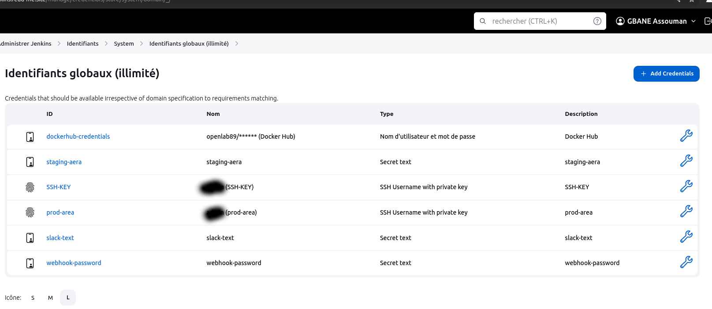

<strong>Création du pipeline</strong><br/>

Pour créer un nouveau pipeline il faut cliquer sur nouveau item à gauche dans le Dashboard puis Pipeline

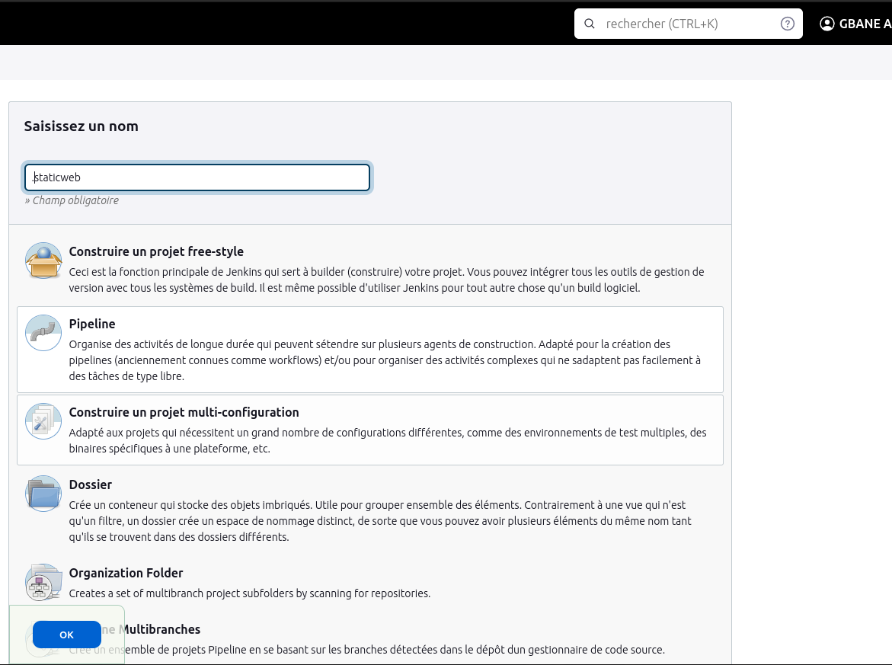

## Configuration du webhook

Pour déclencher automatiquement le lancement du pipeline à partir d'une action réalisée sur GitHub 
il faut:
- Renseigner l'url du repository dans le pipeline 
- Autoriser le déclenchement du webhook
  
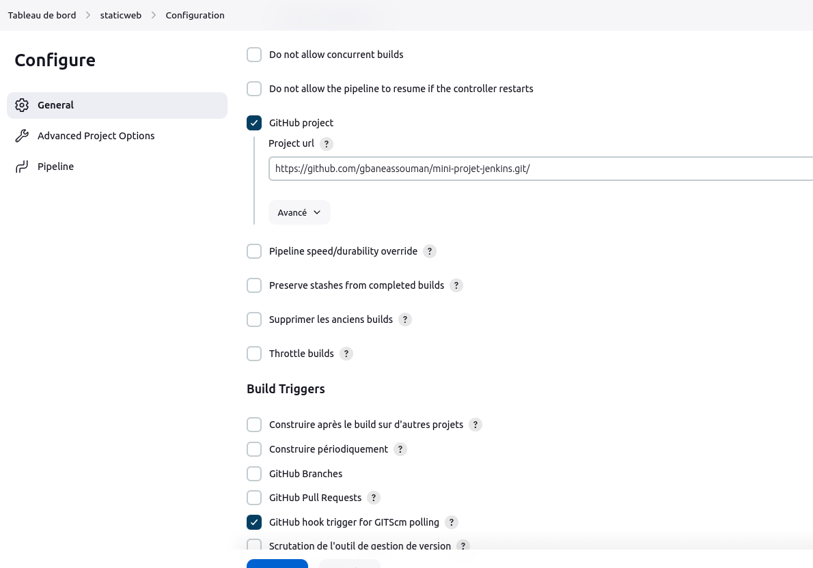

- Configurer le webhook depuis le repository github
  
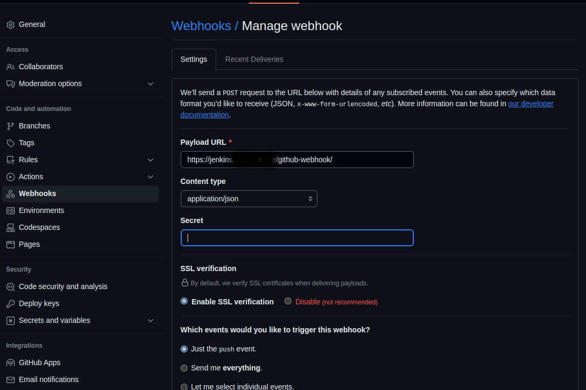

confirmation que le webhook marche

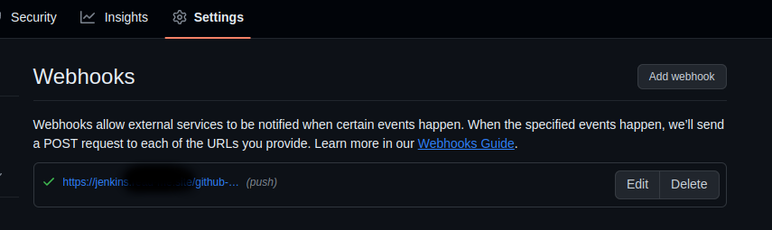

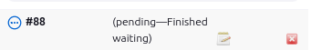

Le pipeline sera basée sur un Jenkinsfile donc dans la section pipeline de la configuration il faut choisir **Pipeline script from SCM**

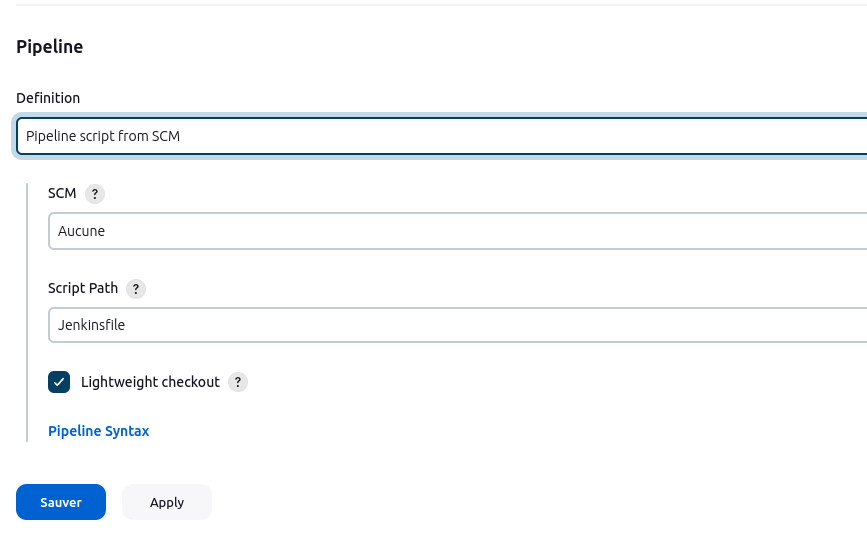

## Intrégation de la notification Slack 

# 
Nous allons intégrer slack à notre environnement jenkins pour recevoir directement des notifications après l'execution de notre pipeline.

- <strong>Installation du plugin slack-notification</strong><br/>

Voici les étapes à suivre pour ajouter l’intégration Jenkins CI.

### Étape 1
Dans le tableau de bord Jenkins, cliquez sur Administrer Jenkins dans la barre de navigation à gauche.


### Étape 2
Cliquez sur Plugins puis Available plugins et recherchez Slack Notification dans l’onglet search available plugins. Cochez la case et installez le plugin.

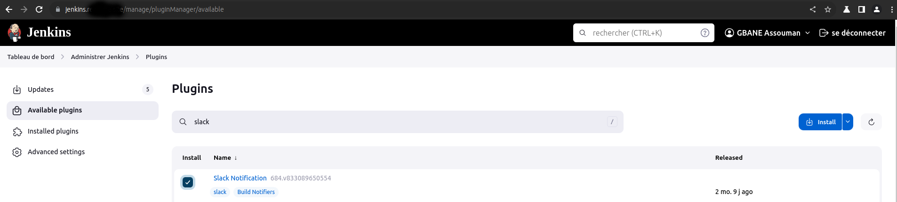

### Étape 3 
Une fois l’installation effectuée, cliquez de nouveau sur Administrer Jenkins dans le volet de navigation gauche, puis accédez à **Configure System** (Configurer le système).

Recherchez la section **Global Slack Notifier Settings** (Paramètres de notification Slack globaux) et ajoutez les valeurs suivantes :

Sous-domaine de l’équipe : **workspace**
Identifiant d’authentification où jeton d’intégration : Créez un identifiant de type secret texte ayant pour valeur **Token**
NB:
Pour obtenir le **workspace** et **Token** il faut au préalable:
- 1 créer un compte slack 
- 2 configurer l'intégration de jenkins à partir d'[ici](https://myspace.slack.com/services/new/jenkins-ci)


à partir de cet instant on peux ajouter les notifications slack dans le **Jenkinsfile**

à fin de rendre disponible la notification slack à tous les projets, je l'ai transformé en **Shared Library** qui va permettre de faire un simple appel dans les **Jenkinsfiles**.

Pour ce faire j'ai :

- créée un depôt **Github** [voir ici](https://github.com/gbaneassouman/shared-library/blob/main/vars/slackNotifier.groovy) et ajouté un fichier de type groovy appelé *slackNotifier.groovy* ensuite definir la fonction de notification ci-dessous

```
#!/usr/bin/env groovy

def call(String buildResult) {
  if ( buildResult == "SUCCESS" ) {
    slackSend color: "good", message: "CONGRATULATION: Job ${env.JOB_NAME} with buildnumber ${env.BUILD_NUMBER} was successful ! more info ${env.BUILD_URL}"
  }
  else if( buildResult == "FAILURE" ) { 
    slackSend color: "danger", message: "BAD NEWS:Job ${env.JOB_NAME} with buildnumber ${env.BUILD_NUMBER} was failed ! more info ${env.BUILD_URL}"
  }
  else if( buildResult == "UNSTABLE" ) { 
    slackSend color: "warning", message: "BAD NEWS:Job ${env.JOB_NAME} with buildnumber ${env.BUILD_NUMBER} was unstable ! more info ${env.BUILD_URL}"
  }
  else {
    slackSend color: "danger", message: "BAD NEWS:Job ${env.JOB_NAME} with buildnumber ${env.BUILD_NUMBER} its result was unclear ! more info ${env.BUILD_URL}"	
  }
}
```

- configurer la Shared Library à partir de ***Administrer jenkins -> System -> Global Pipeline Libraries***


- importer la Shared library précédemment configurée dans le Jenkinsfile 

```
@Library('slack-shared-library') _

```
- et faire appel à la fonction de notification en dehors de la balise des stages

```
post {
        always {
            script {
                /* Use Slack-notification.groovy from shared library */
                slackNotifier currentBuild.result
            }
        }
    }
```
## Production de jenkinsfile 
Le Jenkinsfile contient **08 stages** et un **Post Actions** pour slack

Les Stages sont:
- Cloning code *(recupère le code sur github)*
- Build Image  *(Build de l'image)*
- Test Image  *(test de l'image en créant un conteneur)*
- Release image *(envoie l'image sur dockerhub)*
- Clean image  *(arrête et supprime l'image)*
- Deploy to Satging
- Test in staging
- Deploy to Prod

et les éléments ci-dessous ont été variabilisés pour faciliter leur réutilisation dans les différents stages:

IMAGE_NAME, IMAGE_TAG, DOCKER_HUB, HOST_PORT, INTERNAL_PORT, CONTAINER, STAGING_IP, PROD_IP, USER_NAME, STAGING_NAME, PROD_NAME

<strong>Jenkinsfile</strong><br/>
```
/* groovylint-disable NglParseError */
/* groovylint-disable DuplicateListLiteral, DuplicateStringLiteral, GStringExpressionWithinString, LineLength, NestedBlockDepth, NglParseError */
/* groovylint-disable-next-line CompileStatic */
/* groovylint-disable-next-line CompileStatic, NglParseError */
/* import shared library */
// @library('shared-library')
/* groovylint-disable-next-line CompileStatic */
@Library('slack-shared-library') _

pipeline {
    environment {
        DOCKERHUB_PASSWORD  = credentials('dockerhub-credentials')
    }
    agent any //declaration globale de l'agent
    stages {
        stage('Cloning code') {
            steps {
                script {
                    sh '''
                        rm -rf mini-projet-jenkins || echo "Directory doesn't exists "
                        sleep 2
                        git clone https://github.com/gbaneassouman/mini-projet-jenkins.git
                    '''
                }
            }
        }
        stage('Build image') {
            steps {
                script {
                    /* groovylint-disable-next-line GStringExpressionWithinString */
                    sh '''
                        docker build -t ${IMAGE_NAME}:${IMAGE_TAG} .
                    '''
                }
            }
        }
        stage('Test image') {
            steps {
                script {
                    /* groovylint-disable-next-line GStringExpressionWithinString */
                    // sh 'docker stop ${CONTAINER}|| echo "already stopped"'
                    // sh 'docker rm -f ${CONTAINER} || echo "container does not exist"'
                    sh 'docker run --name ${CONTAINER} -d -p ${HOST_PORT}:${INTERNAL_PORT} ${IMAGE_NAME}:${IMAGE_TAG}'
                    sh 'sleep 10'
                    sh 'curl -k http://172.17.0.1:${HOST_PORT}|grep -i "DIMENSION"'
                }
            }
        }
        stage('Release image') {
            steps {
                script {
                    /* groovylint-disable-next-line GStringExpressionWithinString */
                    sh '''
                        docker save ${IMAGE_NAME}:${IMAGE_TAG} > /tmp/${IMAGE_NAME}:${IMAGE_TAG}.tar
                        docker image tag ${IMAGE_NAME}:${IMAGE_TAG} ${DOCKER_HUB}/${IMAGE_NAME}:${IMAGE_TAG}
                        echo $DOCKERHUB_PASSWORD_PSW | docker login -u ${DOCKER_HUB} --password-stdin
                        docker push ${DOCKER_HUB}/${IMAGE_NAME}:${IMAGE_TAG}
                    '''
                }
            }
        }
        stage('Clean image') {
            steps {
                script {
                /* groovylint-disable-next-line GStringExpressionWithinString */
                    //ps aux  |  grep -i 5000  |  awk '{print $2}'  |  xargs sudo kill -9
                    //kill $(ps aux | grep '5000' | awk '{print $2}')
                    sh '''
                    docker stop ${CONTAINER}
                    docker rm -f ${CONTAINER}
                    docker rmi -f ${IMAGE_NAME}
                    docker rmi -f ${DOCKER_HUB}/${IMAGE_NAME}
                '''
                }
            }
        }
        stage('Deploy to Satging') {
            steps {
                script {
                    /* groovylint-disable-next-line GStringExpressionWithinString, NestedBlockDepth */
                    sshagent(['SSH-KEY']) {
                        sh '''
                            echo $DOCKERHUB_PASSWORD_PSW | docker login -u ${DOCKER_HUB} --password-stdin
                            ssh -o StrictHostKeyChecking=no -l ${USER_NAME} ${STAGING_IP} docker stop ${STAGING_NAME}||echo "stopped"
                            ssh -o StrictHostKeyChecking=no -l ${USER_NAME} ${STAGING_IP} docker rm ${STAGING_NAME}||echo "already deleted"
                            ssh -o StrictHostKeyChecking=no -l ${USER_NAME} ${STAGING_IP} docker pull ${DOCKER_HUB}/${IMAGE_NAME}:${IMAGE_TAG}
                            sleep 120
                            ssh -o StrictHostKeyChecking=no -l ${USER_NAME} ${STAGING_IP} docker run --name ${STAGING_NAME} -d -p ${HOST_PORT}:${INTERNAL_PORT} ${DOCKER_HUB}/${IMAGE_NAME}:${IMAGE_TAG}
                            ssh -o StrictHostKeyChecking=no -l ${USER_NAME} ${STAGING_IP} curl -k http://172.17.0.1:${HOST_PORT}|grep -i "DIMENSION"
                        '''
                    }
                }
            }
        }
        stage('Test in staging') {
            steps {
                script {
                    sshagent(['SSH-KEY']) {
                        sh '''
                            ssh -o StrictHostKeyChecking=no -l ${USER_NAME} ${STAGING_IP} curl -k http://172.17.0.1:${HOST_PORT}|grep -i "DIMENSION"
                        '''
                    }
                }
            }
        }
        stage('Deploy to Prod') {
            steps {
                script {
                    /* groovylint-disable-next-line GStringExpressionWithinString, NestedBlockDepth */
                    sshagent(['prod-area']) {
                        sh '''
                            echo $DOCKERHUB_PASSWORD_PSW | docker login -u ${DOCKER_HUB} --password-stdin
                            ssh -o StrictHostKeyChecking=no -l ${USER_NAME} ${PROD_IP} docker stop ${PROD_NAME}||echo "stopped"
                            ssh -o StrictHostKeyChecking=no -l ${USER_NAME} ${PROD_IP} docker rm ${PROD_NAME}||echo "already deleted"
                            ssh -o StrictHostKeyChecking=no -l ${USER_NAME} ${PROD_IP} docker pull ${DOCKER_HUB}/${IMAGE_NAME}:${IMAGE_TAG}
                            sleep 120
                            ssh -o StrictHostKeyChecking=no -l ${USER_NAME} ${PROD_IP} docker run --name ${PROD_NAME} -d -p ${HOST_PORT}:${INTERNAL_PORT} ${DOCKER_HUB}/${IMAGE_NAME}:${IMAGE_TAG}
                            ssh -o StrictHostKeyChecking=no -l ${USER_NAME} ${PROD_IP} curl -k http://172.17.0.1:${HOST_PORT}|grep -i "DIMENSION"
                        '''
                    }
                }
            }
        }
    }
    post {
        always {
            script {
                /* Use Slack-notification.groovy from shared library */
                slackNotifier currentBuild.result
            }
        }
    }
}
```
<strong>Résultat de l'execution du script </strong><br/>

<div align="center">
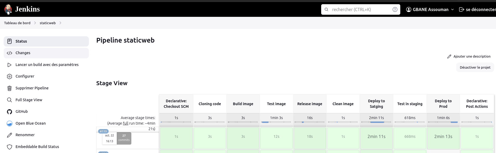<br/>
</div>

<strong>Notification Slack </strong><br/>
<div align="center">
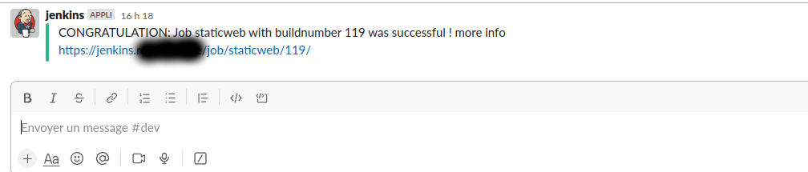<br/>
</div>

<strong>Test in staging	 </strong><br/>

<div align="center"><br/>
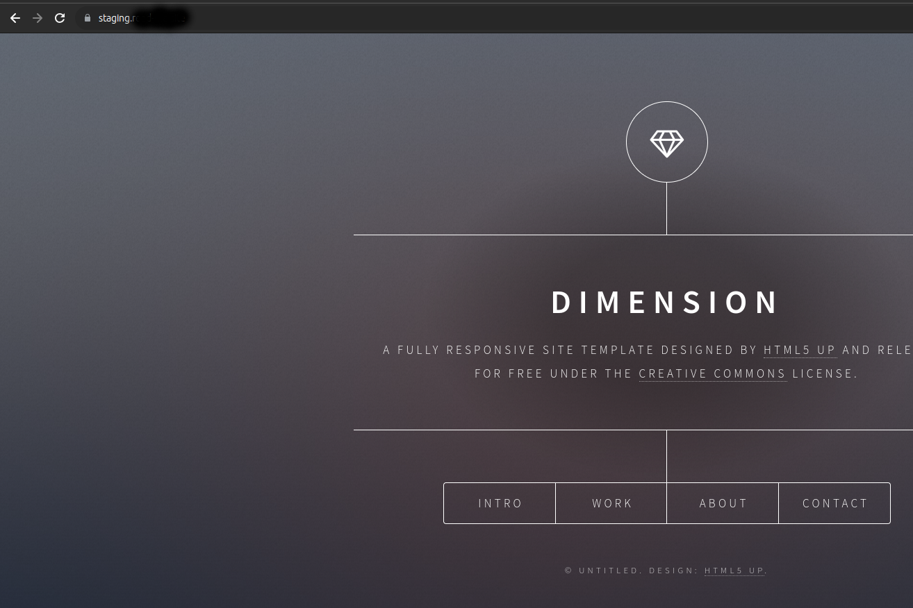<br/>
</div>

<strong>Test in Prod	 </strong><br/>
<div align="center">
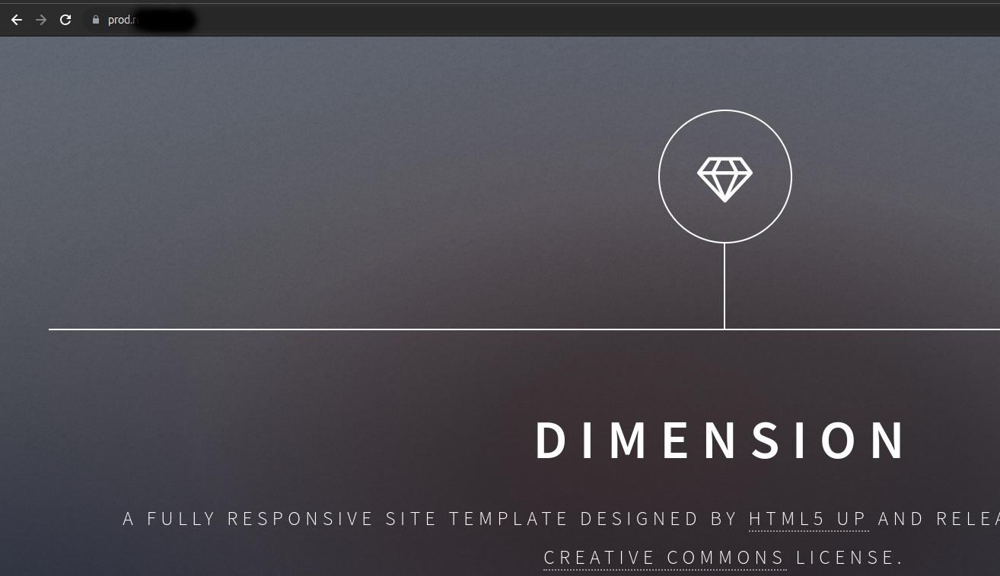<br/>
</div>


## 🚀 Conclusion
Ce fut une expérience enrichissante pour moi car ce module m'a permis de mettre en pratique les connaissances acquises sur Docker, et Jenkins

Assouman GBANE 
LinkedIn          : https://www.linkedin.com/in/gbane-assouman-4ab183123/